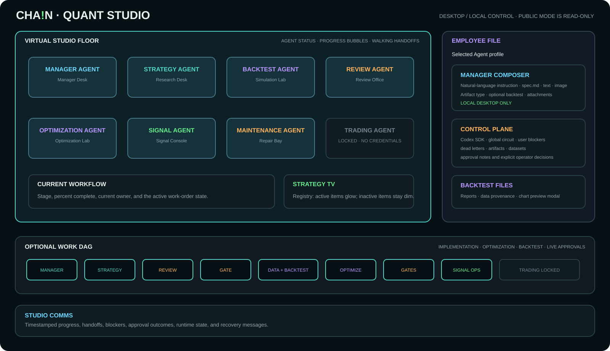

# CHA!N Quant Studio

[](https://github.com/1f0a0c5h/ChainQuantStudio/actions/workflows/ci.yml)

**CHA!N Quant Studio** is a desktop-first, evidence-driven multi-agent framework
for turning a quantitative idea into a versioned, reviewed, optionally backtested,
explicitly approved research artifact. It models a small quantitative studio:
specialized agents own implementation, independent review, replay, optimization,
signal operations, and maintenance while a Manager Agent remains the user's single
point of contact.

The framework deliberately separates:

- a **Signal Definition** — a direction-neutral market condition or notification;
- a **Trading Strategy** — a directional artifact with entry, exit, sizing, and risk;
- deterministic services — data, state, provenance, retries, and release controls;
- user decisions — implementation, optimization, backtest, and live approvals.

> [!IMPORTANT]
> This public repository contains the studio system only. It ships with **zero
> bundled Signal Definitions and zero bundled Trading Strategies**. Private specs,
> datasets, reports, runtime state, logs, and credentials are intentionally excluded.

> [!CAUTION]
> CHA!N is a research and advisory framework, not financial advice. The public
> Trading Agent is locked and the repository contains no order, cancellation,
> withdrawal, transfer, authenticated exchange, or automatic execution path.

## Contents

- [What the system does](#what-the-system-does)
- [Architecture](#architecture)
- [Agent team](#agent-team)
- [Workflow and approval gates](#workflow-and-approval-gates)
- [Desktop UI guide](#desktop-ui-guide)
- [Installation](#installation)
- [Run the studio](#run-the-studio)
- [Connect Telegram](#connect-telegram)
- [Create a Signal or Strategy](#create-a-signal-or-strategy)
- [Data, evidence, and recovery](#data-evidence-and-recovery)
- [Verification](#verification)
- [Troubleshooting](#troubleshooting)
- [Public release boundary](#public-release-boundary)

## What the system does

CHA!N provides a local control plane for a repeatable research lifecycle:

1. The user describes an idea in natural language, uploads `spec.md`, or attaches
   Markdown, text, PNG, JPEG, or WebP context to the Manager Agent.
2. Manager classifies the request as a Signal Definition or Trading Strategy and
   constructs only the DAG nodes required by that specification.
3. Strategy Agent creates a versioned implementation and deterministic tests.
4. Review Agent performs one consolidated independent audit instead of returning
   one issue at a time.
5. The user explicitly approves or rejects the implementation.
6. When requested, Data Service creates or reuses a versioned dataset and Backtest
   Agent produces reproducible evidence and charts.
7. Review Agent audits the backtest package. Optimization Agent may then propose a
   bounded revision for a directional strategy; it cannot edit or approve it.
8. The user separately decides whether to approve the backtest and live release.
9. Signal Agent can run only the exact live-approved Signal Definition version.
10. Maintenance Agent owns visible runtime incidents and verified repairs.

This is not a fixed `Strategy -> Backtest` pipeline. A notification-only Signal can
explicitly omit Backtest and Data Service while still requiring implementation
tests, independent review, and user approval.

## Architecture


The desktop application is the authoritative control surface. Its React UI talks
to a loopback-only Python Gateway at `127.0.0.1:8765`. The Gateway owns validation,
work orders, approvals, files, runtime control, and the Codex worker boundary. The
hosted public web build is redacted and display-only.

Core design properties:

- **Typed optional DAG:** nodes are selected from the normalized spec.
- **Independent approval gates:** implementation, optimization, backtest, and live
  approvals are different operator decisions.
- **Deterministic data plane:** exchange data is normalized, freshness-gated,
  sequence-safe, and versioned independently of LLM work.
- **Evidence before release:** the Artifact Registry links the spec hash, code
  revision, dataset hash, tests, reports, approvals, and timestamps.
- **Bounded failure handling:** retries, checkpoints, dead letters, and a global
  Codex circuit breaker prevent infinite loops and quota retry storms.
- **Locked execution:** Trading Agent has no credentials or exchange action client.

Detailed contracts are available in
[`docs/architecture.md`](docs/architecture.md) and
[`config/STUDIO_WORKFLOW.md`](config/STUDIO_WORKFLOW.md).

## Agent team

CHA!N currently presents eight employees in the studio. Agent separation is based
on role instructions, permissions, handoff contracts, durable state, and tests; it
does not require a separate source-code folder or operating-system process for every
role.

### 1. Manager Agent — studio coordinator

**Purpose:** the user's single point of contact and DAG orchestrator.

- Accepts natural-language requests and supported attachments.
- Adds or modifies Signal Definitions and Trading Strategies.
- Requests evidence from other agents and manages work orders.
- Selects only allowlisted actions through the semantic router.
- Reports progress, consolidated blockers, approvals, and the next required action.
- Pauses and asks one concrete question when only the user can supply a missing
  setting, authority, credential, licensed dataset, or design decision.

Manager cannot change core control-plane code, bypass approval gates, answer
unrelated questions, approve its own work, or enable trading.

### 2. Strategy Agent — artifact implementation

**Purpose:** translate an approved idea into a tested, versioned artifact.

- Implements both direction-neutral Signal Definitions and directional Trading
  Strategies from a normalized specification.
- Preserves explicit venue, market type, symbol, timeframe, timestamp boundary,
  lifecycle, and missing-data behavior.
- Adds deterministic unit and replay tests.
- Produces a handoff containing code revision, tests, assumptions, and limitations.
- Addresses the complete Review blocker batch in one revision cycle.

It does not approve its implementation, perform live execution, or silently change
the user's strategy semantics.

### 3. Review Agent — independent quality gate

**Purpose:** audit the entire applicable gate before returning a decision.

- Is source-read-only and independent of implementation ownership.
- Checks specification alignment, venue/market correctness, temporal integrity,
  look-ahead and target leakage, stale/future data handling, deterministic tests,
  safety boundaries, backtest provenance, metrics, and release conditions.
- Returns `PASS`, `BLOCKED`, or one complete, deduplicated `FAIL` finding set.
- Marks genuinely user-owned blockers with `USER_ACTION_REQUIRED`.

Review findings are evidence. They never become automatic approval.

### 4. Backtest Agent — deterministic market replay

**Purpose:** measure an approved implementation against an immutable dataset.

- Receives the artifact version and Data Service dataset hash.
- Replays the exact requested venue, market type, symbol, timeframe, and date range.
- Produces machine-readable data, a human-readable report, chart files, limitations,
  and provenance.
- Uses USD 10,000 virtual capital for directional Trading Strategies.
- Reports CAGR/ROI, maximum drawdown, Sharpe ratio, win rate and payoff ratio, and
  total trade count with visual evidence.

Backtest Agent never substitutes Spot data for a requested derivatives market and
never calls authenticated exchange endpoints.

### 5. Optimization Agent — bounded post-backtest analyst

**Purpose:** explain weaknesses in an independently accepted backtest and propose a
small, reviewable next revision.

- Runs only for directional Trading Strategies with backtesting enabled.
- Returns `IMPROVE` or `KEEP`, evidence-based diagnoses, trade-offs, overfit guards,
  proposed changes, and required retest evidence.
- Is read-only and cannot edit the strategy, search an unrestricted parameter space,
  or approve its own proposal.

An approved proposal returns to Strategy Agent as a new artifact version.

### 6. Signal Agent — advisory runtime

**Purpose:** operate an exact, live-approved Signal Definition version.

- Consumes normalized, freshness-gated public market data.
- Rejects stale, future, unsynchronized, or invalid-sequence inputs.
- Emits advisory `SIGNAL`, lifecycle, and system notifications.
- Supports graceful shutdown so notification queues can drain and a `STOPPED`
  lifecycle event can be emitted by a configured private runtime.

It cannot run an unapproved artifact or place an order.

### 7. Maintenance Agent — runtime reliability

**Purpose:** diagnose and repair operational failures without changing approved
semantics.

- Owns visible incidents, logs, root-cause analysis, minimal patches, regression
  evidence, and post-repair monitoring.
- Distinguishes exchange, DNS, connection, TLS, read, event-loop, queue, and data
  integrity failures.
- Returns a repair package to the approved runtime path.

Maintenance cannot silently alter thresholds, triggers, direction, risk, or release
approval.

### 8. Trading Agent — locked future desk

**Purpose:** reserve an explicit boundary for possible future execution research.

In this public repository it is permanently **LOCKED**: no credentials, private API,
order endpoint, position management, withdrawal, transfer, or signal consumer is
implemented.

### Data Service — deterministic software, not an LLM agent

Data Service downloads or accepts allowed public market data, normalizes it, checks
ordering and time integrity, content-addresses the result, and reuses identical
venue/market/symbol/timeframe/range/schema requests across work orders. Keeping this
work deterministic avoids wasting model context on reproducible data operations.

## Workflow and approval gates

```text
User
  -> Manager Agent
  -> Strategy Agent
  -> Review Agent (implementation audit)
  -> IMPLEMENTATION APPROVAL
       ├─ Backtest required: no
       │    -> omit Data Service and Backtest
       │    -> LIVE APPROVAL
       └─ Backtest required: yes
            -> Data Service
            -> Backtest Agent
            -> Review Agent (evidence audit)
            -> Trading Strategy only: Optimization Agent
                 ├─ approve revision -> Strategy Agent creates a new version
                 └─ keep version -> continue
            -> BACKTEST APPROVAL
            -> LIVE APPROVAL
  -> exact approved Signal Definition -> Signal Agent
```

No approval starts Signal Agent automatically. The operator approves a version and
then explicitly requests runtime start. Trading Strategies remain research artifacts
while Trading Agent is locked.

## Desktop UI guide

The following diagram is based on the clean local public-mode screen and contains no
private artifacts or work-order data.



### Studio header

The header summarizes the active control surface, Signal Runtime state, and Trading
Desk lock. `DESKTOP / LOCAL CONTROL` means commands and approvals can reach the local
Gateway. `PUBLIC READ-ONLY` means the hosted page is intentionally non-operational.

### Virtual studio floor

Each workstation represents one Agent. Select an employee to open its Employee File.
Status labels distinguish `WORKING`, `STANDBY`, `STOPPED`, and `LOCKED`. While work is
active, a progress bubble appears above the responsible employee. During handoff, the
source employee walks to the destination employee and returns to its own desk; the
animation reflects the actual Gateway handoff rather than creating a generic worker.

### Current workflow and Strategy TV

- **Current Workflow** shows the active work order, current stage, owner, and percent
  complete.
- **Strategy TV** lists registered Signals and Strategies. Running artifacts are
  highlighted; registered but inactive artifacts remain dim. It is a registry/status
  display, not a price chart.

### Employee File and Manager composer

The right-side Employee File shows the selected employee's role, state, current task,
handoff contract, and available files. Selecting Manager opens the conversation
composer:

- enter a natural-language instruction;
- attach `spec.md`, Markdown/text notes, or PNG/JPEG/WebP references;
- choose Signal Definition or Trading Strategy when a spec is attached;
- explicitly choose whether Backtest is required;
- download the canonical `spec.md` template;
- send the complete message and attachments as one work-order intake.

Attachments never broaden Manager permissions. Images and ordinary notes need a text
description explaining what the user wants the system to do.

### Control Plane

The Control Plane reports:

- **Codex SDK:** whether the local worker can authenticate and create turns;
- **Codex Circuit:** closed or temporarily open after quota/provider failure;
- **User Action:** whether a work order needs a human decision or missing input;
- **Dead Letters:** exhausted work orders preserved for inspection;
- **Artifacts:** versioned registry records;
- **Datasets:** reusable Data Service versions.

When Codex is not authenticated, the desktop displays `SIGN IN TO CODEX` and
`RECHECK`. Credentials remain in the current operating-system user's Codex profile;
they are never copied into this repository or the public web build.

### Backtest Files and chart preview

Select Backtest Agent to inspect completed report packages. Each package can expose
the report, machine-readable data, provenance, and chart buttons. Chart buttons open
an in-app preview modal served by the loopback Gateway; they are not external links.

### Optional Work DAG and Studio Comms

The DAG panel shows included nodes and approval gates. Optional nodes are not marked
complete when omitted. Studio Comms is the chronological operational feed for agent
progress, handoffs, Review blockers, approvals, runtime state, and recovery events.

## Installation

### Supported development target

The primary target is the Windows desktop application. The Python framework is
portable, but the commands below are the tested Windows/PowerShell path.

### Prerequisites

| Dependency | Requirement | Why it is needed |
| --- | --- | --- |
| Git | Current release | Clone and update the repository |
| Python | 3.12 or newer | Gateway, agents, data plane, replay, tests |
| Node.js | 22.13 or newer | React/vinext desktop frontend |
| pnpm | Current compatible release | Frontend dependency and script runner |
| Rust/Cargo | stable MSVC toolchain | Tauri desktop shell |
| Microsoft C++ Build Tools | “Desktop development with C++” workload | Windows linker/toolchain |
| Edge WebView2 | Windows 10 1803+ normally includes it | Tauri web renderer |

Tauri's official Windows prerequisites require Microsoft C++ Build Tools and
WebView2, followed by Rust with the MSVC host toolchain. See the
[official Tauri prerequisites](https://v2.tauri.app/start/prerequisites/).

Verify the tools in a **new PowerShell window** after installation:

```powershell
git --version
py -3.12 --version
node --version
pnpm --version
rustc --version
cargo --version
```

If Rust is not installed:

```powershell
winget install --id Rustlang.Rustup -e
rustup default stable-msvc
```

Install Visual Studio Build Tools from
[Microsoft C++ Build Tools](https://visualstudio.microsoft.com/visual-cpp-build-tools/)
and select **Desktop development with C++**. Restart PowerShell after installing.

If `pnpm` is unavailable after installing Node.js, use one of these approaches:

```powershell
corepack enable
corepack prepare pnpm@latest --activate
```

or:

```powershell
npm install --global pnpm@11
```

### 1. Clone the repository

```powershell
Set-Location -LiteralPath 'C:\path\to\your\projects'
git clone https://github.com/1f0a0c5h/ChainQuantStudio.git
Set-Location -LiteralPath '.\ChainQuantStudio'
```

### 2. Create the Python environment

```powershell
py -3.12 -m venv .venv
.\.venv\Scripts\python.exe -m pip install --upgrade pip
.\.venv\Scripts\python.exe -m pip install -e '.[dev,studio]'
```

The `studio` extra installs the Codex Python SDK and its bundled CLI. A globally
installed `codex` command is not required for the desktop sign-in button.

### 3. Create local configuration

```powershell
Copy-Item -LiteralPath '.env.example' -Destination '.env'
```

`.env` is ignored by Git. Never commit or paste its secrets into an issue, report,
chat, screenshot, or log.

### 4. Install desktop dependencies

```powershell
Set-Location -LiteralPath '.\studio-dashboard'
pnpm install --frozen-lockfile
Set-Location -LiteralPath '..'
```

## Run the studio

Use two PowerShell windows. Both processes must run under the same Windows user so
the Gateway can see that user's Codex credential store.

### Terminal A — local Python Gateway

```powershell
Set-Location -LiteralPath 'C:\path\to\ChainQuantStudio'
.\.venv\Scripts\python.exe -m quant_signal_agent.studio.gateway --host 127.0.0.1 --port 8765
```

The Gateway refuses non-loopback bind addresses. Durable local state is written
under the ignored `.runtime/` directory.

### Terminal B — Tauri desktop application

```powershell
Set-Location -LiteralPath 'C:\path\to\ChainQuantStudio\studio-dashboard'
pnpm run desktop:dev
```

`desktop:dev` starts the frontend through Tauri's `beforeDevCommand`. Do **not** run
`pnpm run dev` separately on port 3000 first; an existing vinext server will cause
the Tauri startup command to stop.

When the desktop opens:

1. confirm the header says `DESKTOP / LOCAL CONTROL`;
2. confirm the Gateway state says `CONNECTED`;
3. inspect **Control Plane -> Codex SDK**;
4. if it says `LOGIN REQUIRED`, select **SIGN IN TO CODEX**;
5. finish the device login in the browser, then select **RECHECK**.

The Codex credential belongs to the Windows user profile, not the repository. If the
CLI account changes, restart the Gateway so the SDK process reads the current state.

### Build a Windows desktop package

```powershell
Set-Location -LiteralPath 'C:\path\to\ChainQuantStudio\studio-dashboard'
pnpm run desktop:build
```

Tauri writes release binaries and installers below
`studio-dashboard\src-tauri\target\release\`. Signing and distribution are separate
operator responsibilities.

### Browser-only frontend development

```powershell
Set-Location -LiteralPath 'C:\path\to\ChainQuantStudio\studio-dashboard'
pnpm run dev
```

Open `http://localhost:3000/`. Localhost may use the local Gateway; the deployed
public website remains redacted and read-only.

## Connect Telegram

CHA!N contains a bounded Telegram `sendMessage` transport for advisory Signal and
system notifications. Telegram setup does not enable trading and does not create a
Signal Definition.

Telegram's official bot documentation starts with
[@BotFather](https://core.telegram.org/bots) and uses the HTTPS
[Bot API](https://core.telegram.org/bots/api).

### 1. Create a bot

1. Open Telegram and start a conversation with `@BotFather`.
2. Send `/newbot`.
3. Choose the display name and a unique username ending in `bot`.
4. Copy the generated bot token to a password manager. Anyone with this token can
   control the bot, so do not commit, screenshot, or share it.

### 2. Choose the destination

For a private chat:

1. Open the new bot and send `/start` or any message.
2. Read the latest update and inspect `message.chat.id`:

```powershell
$token = Read-Host 'Telegram bot token'
$updates = Invoke-RestMethod -Method Get -Uri ("https://api.telegram.org/bot{0}/getUpdates" -f $token)
$updates.result | Select-Object -Last 1 -ExpandProperty message | Select-Object -ExpandProperty chat
Remove-Variable token, updates
```

Use the returned `id` as `QSA_TELEGRAM_CHAT_ID`.

For a channel:

1. Add the bot to the channel as an administrator with permission to post messages.
2. Use the public channel username such as `@your_channel` as the chat ID, or use
   the numeric channel ID returned by the Bot API.

Telegram bots cannot start a private conversation; the user must contact the bot
first. The official [`getUpdates`](https://core.telegram.org/bots/api#getupdates)
method will not work while that bot has an outgoing webhook configured.

### 3. Store the local configuration

Edit the ignored root `.env` file:

```dotenv
QSA_TELEGRAM_BOT_TOKEN=replace_with_your_bot_token
QSA_TELEGRAM_CHAT_ID=replace_with_numeric_id_or_channel_username
```

Restart the private Signal Runtime after changing `.env`. The Gateway UI never
displays these values.

### 4. Test the destination

The following PowerShell test reads the ignored `.env`, sends one explicit test
message through Telegram's official `sendMessage` method, and does not print the
token:

```powershell
$settings = @{}
Get-Content -LiteralPath '.env' | ForEach-Object {
    if ($_ -match '^\s*([^#][^=]*)=(.*)$') {
        $settings[$matches[1].Trim()] = $matches[2].Trim()
    }
}
$uri = 'https://api.telegram.org/bot{0}/sendMessage' -f $settings.QSA_TELEGRAM_BOT_TOKEN
$body = @{
    chat_id = $settings.QSA_TELEGRAM_CHAT_ID
    text = 'CHA!N Quant Studio Telegram connection test'
    disable_web_page_preview = $true
}
Invoke-RestMethod -Method Post -Uri $uri -Body $body | Select-Object ok
$settings.Clear()
Remove-Variable uri, body, settings
```

Expected result: `ok` is `True` and the destination receives the test message.

> [!NOTE]
> The public repository has no bundled Signal Definition, so setting Telegram
> variables alone cannot emit market signals. Notifications begin only after a
> private artifact runtime instantiates the notifier and the exact artifact version
> has passed the required review and approval gates.

Notification failures are sanitized. Rate limits and temporary server/network
failures are retryable and must not restart or block the core market-data stream.

## Create a Signal or Strategy

### Option A — Manager conversation

Open Manager Agent and describe the desired market, condition, timeframe, lifecycle,
missing-data behavior, and whether a backtest is required. Manager may ask for one
missing decision before creating the work order.

### Option B — upload `spec.md`

Download the canonical template from **GET SPEC TEMPLATE**, or copy
[`spec.example.md`](spec.example.md). The concise user spec contains:

- artifact kind: Signal Definition or Trading Strategy;
- purpose and plain-language behavior;
- venue, market type, symbols, and timeframes;
- exact trigger/entry/exit/risk semantics;
- timestamp and closed-candle boundaries;
- lifecycle, cooldown, invalidation, and reset behavior;
- stale/future/missing-data rules;
- examples and acceptance criteria;
- `Backtest required: yes|no`.

Users do not manually maintain DAG nodes, hashes, checkpoints, or approvals. The
normalizer produces the internal `chain-normalized-spec/v1` contract validated by
[`config/spec.normalized.schema.json`](config/spec.normalized.schema.json).

Developer-only backtest DSL examples live in
[`examples/internal-backtest-spec.v2.md`](examples/internal-backtest-spec.v2.md);
that file is not the user upload template.

## Data, evidence, and recovery

### Artifact Registry

Each evidence record links the work-order ID, source spec SHA-256, code revision,
dataset SHA-256, tests, reports, approvals, and recording timestamp. Generated
artifacts stay in ignored local paths unless the operator explicitly publishes a
sanitized package.

### Checkpoints and retry limits

- Work resumes from the last incomplete DAG node after process restart.
- A work order enters the dead-letter queue after 30 counted failures in total or
  when the same stable Review issue occurs for the sixth time.
- Provider quota waits do not consume the retry budget.
- Review inspects all applicable categories and returns blockers as one batch.

### Global Codex circuit breaker

Quota/provider failures open one global circuit. All Codex work waits for the
provider recovery time instead of retrying each work order independently. An
operator may explicitly confirm a quota reset; the next real Codex turn becomes the
capacity probe and reopens the circuit without consuming retry budget if unavailable.

### Market-data integrity

- Exchange-specific logic remains inside adapters and uses public endpoints only.
- Events cannot regress in exchange timestamp or cross an invalid order-book
  generation.
- A sequence gap invalidates the book immediately; the affected book rebuilds in a
  new generation before consumption.
- Stale, future, or unsynchronized data cannot enter an approved strategy decision.
- Supplemental context cannot become a trigger without an exact versioned spec.

## Verification

Run the repository gates before committing a change:

```powershell
Set-Location -LiteralPath 'C:\path\to\ChainQuantStudio'
.\.venv\Scripts\python.exe tools\check_secrets.py
.\.venv\Scripts\python.exe -m ruff check .
.\.venv\Scripts\python.exe -m mypy src
.\.venv\Scripts\python.exe -m pytest --cov=quant_signal_agent --cov-branch
.\.venv\Scripts\python.exe -m compileall -q src tests
git diff --check

Set-Location -LiteralPath '.\studio-dashboard'
pnpm run lint
pnpm run build
```

Live public-exchange integration tests are opt-in and must never use authenticated
credentials.

## Troubleshooting

### `pnpm` is not recognized

Restart PowerShell after installing Node.js, then enable Corepack or install pnpm:

```powershell
corepack enable
corepack prepare pnpm@latest --activate
pnpm --version
```

### “Another vinext dev server is already running”

`desktop:dev` already starts the frontend. Stop the older server shown in the error:

```powershell
taskkill /PID <PID_FROM_ERROR> /F
pnpm run desktop:dev
```

### `cargo` is missing or blocked

Verify the MSVC toolchain from a new PowerShell window:

```powershell
Get-Command cargo
rustup default stable-msvc
cargo --version
```

If Windows App Control or organizational policy blocks `cargo.exe`, the operator or
administrator must allow the installed Rust toolchain; do not disable security
controls merely to build the application.

### Gateway shows offline

Confirm Terminal A is still running and that the loopback port is listening:

```powershell
Get-NetTCPConnection -LocalPort 8765 -State Listen
Invoke-RestMethod -Uri 'http://127.0.0.1:8765/health'
```

### Codex SDK says login required after login

The Gateway and login must use the same Windows account. Restart the Gateway after
changing Codex accounts, then use **RECHECK**. Credentials are isolated by the
operating-system user profile, not by the repository folder.

### Public page cannot send commands

This is intentional. The hosted web build is redacted and read-only. Use the Tauri
desktop app or localhost control surface with the loopback Gateway for commands,
uploads, approvals, files, and process control.

### Telegram returns `401 Unauthorized`

The bot token is invalid or revoked. Generate a replacement in `@BotFather`, update
the ignored `.env`, and restart the runtime.

### Telegram returns `400 chat not found`

For a private chat, send the bot a message first and re-check `getUpdates`. For a
channel, verify the bot is an administrator and the channel username or numeric ID
is correct.

## Public release boundary

Included:

- optional DAG orchestration and approval controls;
- generic Signal/Strategy registries and normalized contracts;
- deterministic state, ingestion, Data Service, and replay components;
- public exchange market-data adapters;
- generic backtesting DSL, metrics, reports, and tests;
- loopback Gateway and Tauri/React desktop UI;
- Agent instructions, safety rules, and verification tooling.

Excluded:

- private Signal Definitions and Trading Strategies;
- proprietary thresholds, symbols, or research conclusions;
- generated reports, charts, datasets, logs, or work-order state;
- Telegram, OpenAI, exchange, or other credentials;
- authenticated exchange clients and trading execution.

User-created artifacts belong in ignored local directories such as
`signals/implemented/`, `strategies/implemented/`, `reports/`, `data/backtest/`,
and `.runtime/`.

## License

No open-source license is granted by this repository. Review the package metadata
and repository terms before reuse or redistribution.
