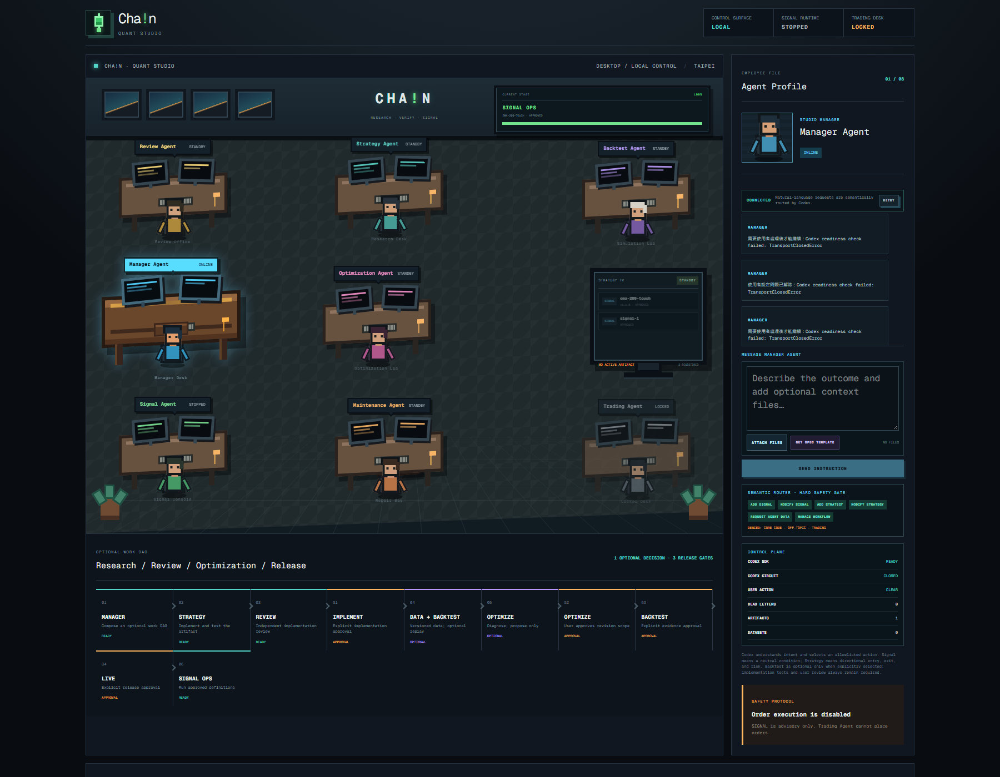
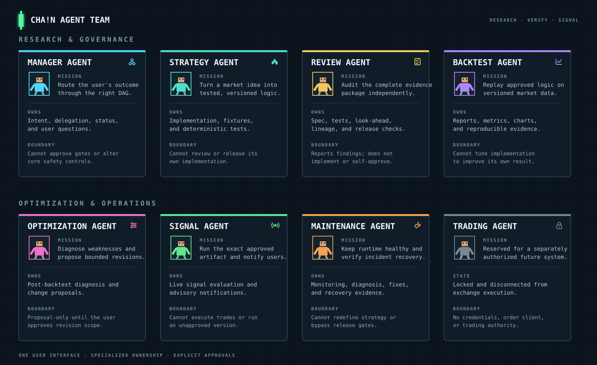

# CHA!N Quant Studio

[](https://github.com/1f0a0c5h/ChainQuantStudio/actions/workflows/ci.yml)

**CHA!N Quant Studio** is a desktop-first multi-agent workspace for turning a
quantitative idea into a versioned, reviewed, optionally backtested, and explicitly
approved research artifact.

The studio keeps two artifact types separate:

- **Signal Definition** — a direction-neutral market condition or notification.
- **Trading Strategy** — a directional system with entry, exit, sizing, and risk rules.

The Manager Agent is the user's single point of contact. It selects an optional work
DAG, delegates each stage to a specialist, and pauses at the approval gates that
require a human decision.

> [!CAUTION]
> CHA!N is a research and advisory framework, not financial advice. The Trading
> Agent is locked in this release and cannot place, cancel, or modify orders.

## Studio interface



The screenshot above is the running local desktop interface, including registered
artifacts and the current Signal Ops state. The main surfaces are:

- **Studio floor** — every employee has an independent state and workstation.
- **Current Stage** — shows the active work order and its progress.
- **Strategy TV** — lists registered Signal Definitions and Trading Strategies;
  running artifacts are illuminated while inactive artifacts stay dim.
- **Employee File** — select an Agent to inspect status, messages, reports, and files.
- **Manager conversation** — send natural-language instructions and attach Markdown,
  text, PNG, JPEG, or WebP context in the same message.
- **Optional Work DAG** — shows the selected nodes and approval gates for the current
  request instead of pretending that every artifact needs the same pipeline.
- **Control Plane** — reports worker readiness, circuit state, required user action,
  dead letters, artifacts, and datasets.

## Architecture


The Tauri desktop application talks to a loopback-only Python Gateway. The Gateway
owns work orders, state transitions, approvals, runtime control, and Agent dispatch.
Deterministic services handle market data, artifact provenance, retry limits,
checkpoints, and release validation.

Key design choices:

- optional DAG nodes are derived from the normalized specification;
- implementation, optimization, backtest, and live release are separate approvals;
- Review Agent returns one consolidated finding set per review pass;
- Data Service versions reusable datasets independently of Agent reasoning;
- Artifact Registry links spec hash, source revision, dataset hash, tests, reports,
  approvals, and timestamps;
- retries are bounded and recoverable work is checkpointed;
- order execution remains unavailable.

## Agent team



Each Agent owns a narrow stage and a clear authority boundary. The Manager coordinates
the team, but implementation, independent review, evidence production, optimization,
live Signals, and maintenance remain separate responsibilities. The desktop floor is
the source of truth for their real-time status.

## Workflow

```text
User idea / spec / attachments
              |
              v
        Manager Agent
              |
              v
        Strategy Agent
              |
              v
         Review Agent
              |
              v
   [Implementation approval]
              |
       +------+------+
       |             |
       | no replay   | backtest requested
       |             v
       |       Data Service
       |             |
       |       Backtest Agent
       |             |
       |        Review Agent
       |             |
       |   Optimization Agent (optional)
       |             |
       |     [Backtest approval]
       +------+------+
              |
       [Live approval]
              |
         Signal Agent
              |
      Maintenance Agent
```

A notification-only Signal can skip Data Service and Backtest when the specification
sets `backtest_required: false`. It still requires implementation tests, independent
review, and explicit approval before Signal Ops can run it.

## Quick start

### Requirements

- Windows 10/11 with Microsoft WebView2 and MSVC Build Tools
- Python 3.12+
- Node.js 22.13+, pnpm, and Rust stable
- Git

### Install

```powershell
git clone https://github.com/1f0a0c5h/ChainQuantStudio.git
Set-Location -LiteralPath '.\ChainQuantStudio'

py -3.12 -m venv .venv
& '.\.venv\Scripts\python.exe' -m pip install --upgrade pip
& '.\.venv\Scripts\python.exe' -m pip install -e '.[dev,research,studio]'

Copy-Item -LiteralPath '.\.env.example' -Destination '.\.env'

Set-Location -LiteralPath '.\studio-dashboard'
pnpm install
```

The Agent worker uses the local Codex SDK. Complete its normal sign-in once before
submitting work orders:

```powershell
& '..\.venv\Lib\site-packages\codex\_cli\_bin\bin\codex.exe' login
```

### Run

Start the local Gateway from the repository root:

```powershell
& '.\.venv\Scripts\python.exe' -m quant_signal_agent.studio.gateway
```

Then start the desktop application in a second PowerShell window:

```powershell
Set-Location -LiteralPath '.\studio-dashboard'
pnpm run desktop:dev
```

The Gateway listens only on `127.0.0.1:8765`. The desktop UI should show
`CONTROL SURFACE: LOCAL` and `CODEX SDK: READY` before a work order is submitted.

## Connect Telegram

Telegram is an optional outbound notification channel for Signals and system status.
It does not enable trading.

1. Create a bot with [@BotFather](https://t.me/BotFather) and copy its token.
2. Send one message to the new bot. For a channel, add the bot and grant permission
   to post.
3. Read the destination ID from Telegram's official `getUpdates` endpoint:

   ```powershell
   $token = Read-Host 'Telegram bot token'
   (Invoke-RestMethod -Uri ("https://api.telegram.org/bot{0}/getUpdates" -f $token)).result |
       ConvertTo-Json -Depth 8
   ```

4. Add the values to the repository-root `.env` file:

   ```dotenv
   QSA_TELEGRAM_BOT_TOKEN=replace_with_your_bot_token
   QSA_TELEGRAM_CHAT_ID=replace_with_numeric_id_or_channel_username
   ```

5. Restart the Gateway so it loads the new environment.

Never commit `.env`, tokens, chat IDs, exchange credentials, or private artifacts.

## Create a Signal or Strategy

Use **GET SPEC TEMPLATE** in the Manager conversation, or copy
[`spec.example.md`](spec.example.md). The user-facing template asks for intent and
behavior; the normalized schema is an internal contract produced by the system.

The most important choices are:

- `artifact_type`: `signal_definition` or `trading_strategy`;
- `backtest_required`: whether replay evidence is required;
- market, instrument, timeframe, timing boundary, and stale-data policy;
- deterministic rules and acceptance criteria;
- notification and release expectations.

Attach the completed file to the Manager message and describe the desired outcome.
Manager will request missing user-owned configuration instead of inventing it.

## Backtest evidence

When replay is selected, Backtest Agent starts with a virtual USD 10,000 portfolio
for directional strategies and publishes a report, data manifest, and interactive
charts. The standard report includes:

- CAGR / ROI and an equity curve;
- maximum drawdown and underwater periods;
- Sharpe ratio and rolling risk-adjusted performance;
- win rate, payoff ratio, and trade outcome distribution;
- total trade count and trade-frequency context.

Every result is tied to the exact spec, implementation, and dataset hashes. Review
Agent checks timing alignment, fees, look-ahead leakage, dataset lineage, and
reproducibility before evidence can reach an approval gate.

## Reliability and safety

- global circuit breaking prevents quota/provider retry storms;
- work orders have bounded retries, checkpoints, and a dead-letter state;
- stale, future, incomplete, or unsynchronized data is rejected before strategy use;
- notification and context-data failure cannot silently become an order action;
- live runtime selection is pinned to an explicitly approved artifact version;
- clean shutdown sends a final system notification when configured;
- secrets and local runtime data remain outside version control.

## Development checks

```powershell
& '.\.venv\Scripts\python.exe' -m pytest -q
& '.\.venv\Scripts\python.exe' -m ruff check .
& '.\.venv\Scripts\python.exe' -m mypy src

Set-Location -LiteralPath '.\studio-dashboard'
pnpm run lint
pnpm run build
```

See [`STUDIO_WORKFLOW.md`](config/STUDIO_WORKFLOW.md),
[`BACKTESTING.md`](config/BACKTESTING.md), and
[`TRADING_BACKTEST_STANDARD.md`](config/TRADING_BACKTEST_STANDARD.md) for the formal
contracts behind the interface.

## License

See the repository license metadata before redistribution or commercial use.
