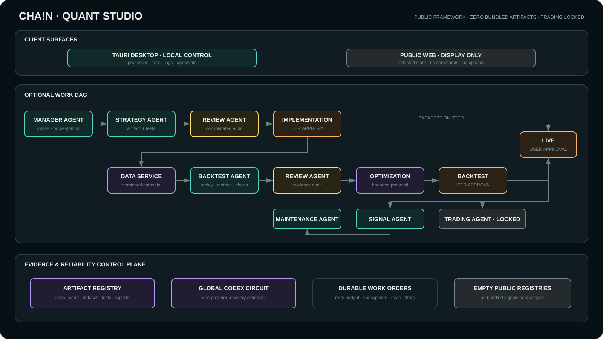

# CHA!N Quant Studio

CHA!N Quant Studio is a desktop-first, evidence-driven framework for building,
reviewing, backtesting, approving, and operating quantitative research artifacts.
It separates direction-neutral **Signal Definitions** from directional
**Trading Strategies** and records each decision in a versioned work DAG.

> This public repository contains the studio system only. It ships with **zero
> bundled Signal Definitions and zero bundled Trading Strategies**. Private specs,
> datasets, reports, runtime state, and credentials are intentionally excluded.

## Studio roles

- **Manager Agent** is the user's single contact and orchestrates allowlisted work.
- **Strategy Agent** implements a versioned Signal Definition or Trading Strategy.
- **Review Agent** independently audits the complete spec, code, tests, data
  provenance, look-ahead risk, and release conditions in one consolidated pass.
- **Backtest Agent** runs reproducible replays and produces evidence and charts.
- **Optimization Agent** diagnoses reviewed strategy results and proposes bounded
  revisions; it cannot edit code or approve a release.
- **Signal Agent** runs only an explicitly live-approved Signal Definition version.
- **Maintenance Agent** owns runtime incidents and regression evidence.
- **Trading Agent** is locked and has no credentials or order capability.
- **Data Service** is deterministic software that versions and shares market data.

## Architecture



The workflow is optional rather than a fixed pipeline. A work order can omit data
and backtesting when its spec says that backtesting is not required. Implementation,
backtest, optimization, and live decisions remain separate approval gates. See
[docs/architecture.md](docs/architecture.md) and
[config/STUDIO_WORKFLOW.md](config/STUDIO_WORKFLOW.md).

## Public release boundary

The repository includes the orchestration framework, generic signal/strategy
registries, deterministic state and ingestion components, public exchange adapters,
generic backtesting DSL, test suite, local Gateway, and Tauri/React desktop UI.

It does **not** include:

- private Signal Definitions or Trading Strategies;
- proprietary thresholds, symbols, or research conclusions;
- generated backtests, charts, datasets, logs, or work-order state;
- exchange, Telegram, OpenAI, or other credentials;
- authenticated exchange clients or trading execution.

User-created artifacts belong in ignored local directories such as
`signals/implemented/`, `strategies/implemented/`, `reports/`, `data/backtest/`,
and `.runtime/`.

## Local development

Requirements: Python 3.12+, Node/pnpm, Rust/Cargo, and Windows MSVC Build Tools for
the Tauri desktop build.

```powershell
Set-Location -LiteralPath 'C:\path\to\chain-quant-studio'
python -m venv .venv
.\.venv\Scripts\python.exe -m pip install -e '.[dev,studio]'
Copy-Item .env.example .env
.\.venv\Scripts\python.exe -m quant_signal_agent.studio.gateway
```

In another PowerShell window:

```powershell
Set-Location -LiteralPath 'C:\path\to\chain-quant-studio\studio-dashboard'
pnpm install
pnpm run desktop:dev
```

The desktop app is the primary control surface. The web build is a redacted,
display-only surface and must not expose commands, approvals, local paths, uploads,
credentials, or raw logs.

## Verification

```powershell
.\.venv\Scripts\python.exe tools\check_secrets.py
.\.venv\Scripts\python.exe -m ruff check .
.\.venv\Scripts\python.exe -m mypy src
.\.venv\Scripts\python.exe -m pytest --cov=quant_signal_agent
Set-Location studio-dashboard
pnpm run lint
pnpm run build
pnpm run test
```

## Safety and licensing

Signals are advisory data. The public project has no order, cancellation,
withdrawal, or transfer path. Exchange integrations are limited to documented
public market-data endpoints. No open-source license is granted by this repository;
see the package metadata before reuse or redistribution.
