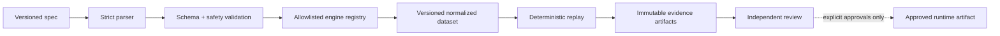

# Spec-driven backtesting framework

The public framework implements a deterministic, allowlisted backtest boundary. It
does not bundle a research strategy, historical dataset, parameter selection, or
result report.

## Two specification layers

1. A concise user-facing `spec.md` describes intent and whether a backtest is
   required.
2. Manager and Strategy Agent normalize that request into the internal schema used
   by Review, Data Service, and Backtest Agent.

The v2 schema supports a horizon-neutral feature DSL composed from allowlisted
rolling, comparison, aggregation, and Boolean operators. Specs cannot execute
Python, shell commands, imports, arbitrary paths, or URLs. The developer-only
`examples/internal-backtest-spec.v2.md` demonstrates internal schema shape; it is
not a user template or bundled artifact.

## Workflow



There is no automatic promotion. A result cannot change a runtime threshold,
enable an artifact, or invoke an exchange action.

## Data and provenance

Normalized research catalogs live below ignored `data/backtest/`. Every run records
the spec SHA-256, code revision, dataset SHA-256, engine version, UTC timestamps,
tests, output artifacts, and limitations. Missing partitions stay missing and are
never zero-filled. Time-series features must exclude the target observation and
must not read future data.

Generated artifacts live below the ignored directory:

```text
reports/backtests/<artifact-id>/<UTC timestamp>-<spec hash>/
├── manifest.json
├── normalized-spec.json
└── result.json
```

## Engine boundary

The registry accepts only code-reviewed `BacktestEngine` implementations. A spec
may select a registered engine and supported parameters but cannot name a module,
class, executable, or dynamic import. New formula families require reviewed code
and deterministic tests; changing supported parameters requires a new immutable
spec version.

The public registry contains the generic feature-DSL engine only. Private engine
adapters, datasets, specs, and reports must remain outside the public repository.

## Review and release

Review Agent audits specification coverage, data provenance, look-ahead/target
leakage, parity, holdout design, metric correctness, limitations, and evidence in
one consolidated pass. Directional Trading Strategy results may then enter the
read-only Optimization Agent for a bounded proposal. Implementation, backtest,
optimization, and live approvals are separate user decisions.
