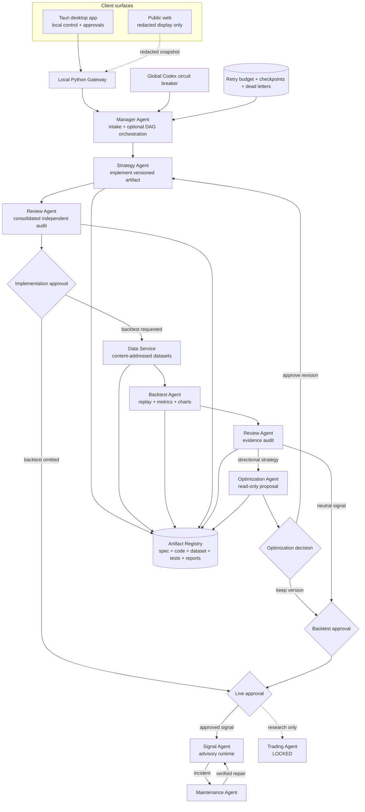

# CHA!N Quant Studio Architecture

CHA!N is a desktop-first control plane for versioned quantitative research. The
public distribution is deliberately empty of concrete Signal Definitions and
Trading Strategies.

## Contracts

- A work order is a selectable DAG, not a mandatory linear pipeline.
- `Backtest required: no` omits Data Service and Backtest nodes; no stage is
  falsely marked complete.
- Implementation, backtest, optimization, and live decisions are distinct gates.
- Review is read-only and reports all blocking findings in one consolidated pass.
- Optimization is read-only, cannot mine unrestricted parameters, cannot change
  code, and cannot approve its own proposal.
- Data Service is deterministic software, not an LLM agent. Dataset identity is
  derived from venue, market, symbol, timeframe, range, schema, and content hash.
- Artifact Registry links each work order to immutable provenance and evidence.
- Retry budgets, checkpoints, dead letters, and one global provider circuit
  breaker prevent infinite retry loops.
- The Signal Agent can run only an exact live-approved artifact version.
- The Trading Agent remains locked and has no authenticated exchange capability.

## Deployment

- **Desktop (primary):** Tauri hosts the React control surface and connects to the
  local Python Gateway for process, file, approval, and report operations.
- **Public web:** redacted display/demo only. It cannot issue commands, upload
  files, approve work, control processes, read local paths, or expose raw logs.

The public repository starts with empty artifact registries. Concrete signals,
strategies, datasets, reports, and runtime state are local/private inputs.
